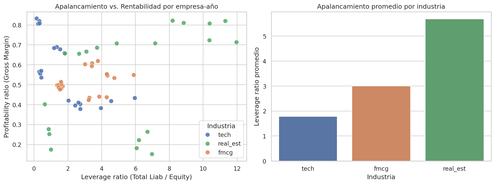

# Análisis de Ratios Financieros por Industria

Análisis en Python de balances y estados de resultados de 14 empresas (tecnología, bienes de
consumo masivo e inmobiliario) para calcular ratios de apalancamiento y rentabilidad, y responder
preguntas de negocio orientadas a decisiones de inversión.

## Contexto

Proyecto desarrollado para practicar y demostrar un flujo de trabajo típico de análisis financiero
con `pandas`: limpieza y unión de estados financieros, cálculo de ratios, agregación por grupo y
visualización de resultados. Aplica herramientas que uso en mi rol actual de Análisis de Datos en
**Punto Ticket** (conciliaciones bancarias, tesorería y automatización de reportes financieros con
SQL Server, Power BI, Python y Excel Avanzado).

**Autora:** Daniela Araya Cáceres — Ingeniera Comercial, Diplomado en Python y Data Science (PUC).

## Pregunta de negocio

Un gestor de hedge fund necesita comparar rápidamente la salud financiera de empresas de distintas
industrias:

1. ¿Qué tipo de empresa tiene el ratio de rentabilidad más bajo?
2. ¿Qué tipo de empresa tiene el mayor ratio de apalancamiento?
3. ¿Cuál es la relación entre apalancamiento y rentabilidad en las empresas inmobiliarias?

## Datos

- `data/Balance_Sheet.xlsx` — balance general por empresa y año (activos, pasivos, patrimonio).
- `data/Income_Statement.xlsx` — estado de resultados por empresa y año (ingresos, costos, utilidad).

Ambos archivos comparten las columnas `company` (ticker), `comp_type` (`tech`, `fmcg`, `real_est`) y
`Year`. Datos de 14 empresas (AAPL, MSFT, GOOG, AMZN, META, BAM, AMT, CCI, SPG, WY, NSRGY, PG, PEP,
UL, KO) entre 2018 y 2022.

## Metodología

**Ratio de apalancamiento** (`leverageratio`) — debt-to-equity:

```
leverageratio = Total Liab / Total Stockholder Equity
```

**Ratio de rentabilidad** (`profitabilityratio`) — margen bruto:

```
profitabilityratio = Gross Profit / Total Revenue
```

Ambos ratios se calculan por empresa-año y se combinan en un único DataFrame (`dfratios`) uniendo
balance general y estado de resultados por `company`, `Year` y `comp_type`.

## Resultados principales

| Industria | Rentabilidad promedio | Apalancamiento promedio |
|---|---|---|
| fmcg | 0.514 (la más baja) | 3.00 |
| real_est | 0.535 | **5.69 (la más alta)** |
| tech | 0.572 | 1.78 |



- **Rentabilidad más baja:** `fmcg` — coherente con un negocio de alto volumen y márgenes ajustados
  por la naturaleza competitiva del sector de consumo masivo.
- **Mayor apalancamiento:** `real_est` — las inmobiliarias financian activos de largo plazo
  (propiedades) principalmente con deuda, casi 6x su patrimonio en promedio.
- **Relación apalancamiento-rentabilidad en real estate:** correlación de **+0.50** → relación
  **positiva**. Dentro del sector inmobiliario, las empresas más apalancadas tienden a mostrar
  también mayor margen bruto, consistente con el efecto de apalancamiento financiero sobre el
  retorno de activos generadores de renta.

## Estructura del repositorio

```
.
├── data/
│   ├── Balance_Sheet.xlsx
│   ├── Income_Statement.xlsx
│   └── dfratios.csv          # ratios calculados, listos para usar
├── images/
│   └── leverage_vs_profitability.png
├── notebooks/
│   └── analisis_ratios_financieros.ipynb
├── requirements.txt
└── README.md
```

## Cómo reproducir el análisis

```bash
git clone <url-de-este-repo>
cd analisis-ratios-financieros
pip install -r requirements.txt
jupyter notebook notebooks/analisis_ratios_financieros.ipynb
```

## Herramientas

Python · pandas · numpy · seaborn · matplotlib · Jupyter

---

*Este proyecto forma parte de mi portafolio de análisis de datos. Para más antecedentes sobre mi
experiencia en análisis financiero y automatización de reportes, revisa mi CV o contáctame por
LinkedIn.*
